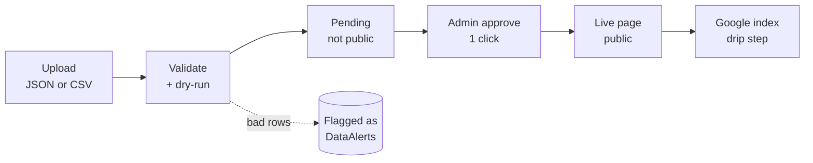
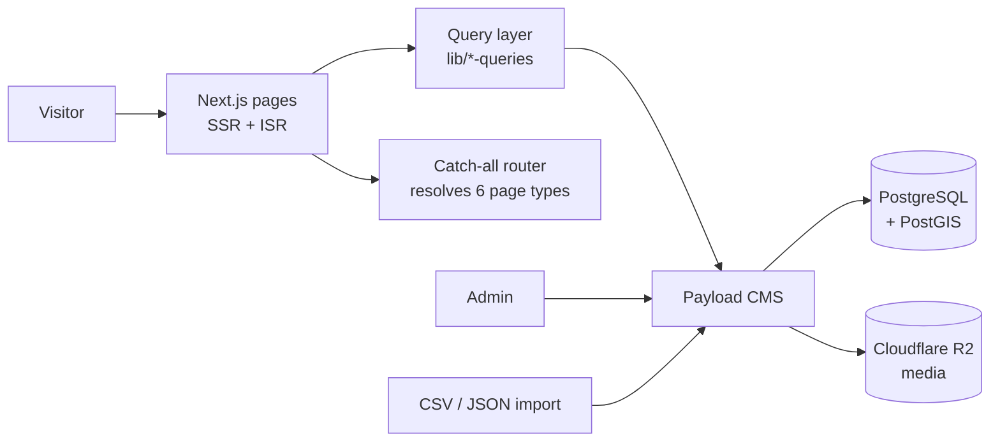

# injector.world — Full Codebase Audit (Final)

**Date:** 2026-06-19 · **Auditor:** Claude (Opus 4.8) · **Type:** Read-only audit (no app code changed)

**How it was done:** Static code review of every API route + all 25 data collections + config, PLUS live tests against the running site (login, real JSON + CSV imports, ~50 page loads, accessibility checks, light/dark/mobile screenshots). A full database backup was taken first and restored at the end, so the local database is exactly as it started.

> This report is written for non-engineers. Every finding says **what it is**, **where it is**, **why it matters**, and **how to fix it**. There is a plain-English glossary at the bottom (section 14) — if a word looks technical, it's explained there.

---

## 1. The headline

**The site is in genuinely good shape. Grade: A− (launch-ready after a short fix list).**

```
Overall:        A-   ███████████████████░   "Strong. Fix the list below, then ship."
Security        A-   ███████████████████░
Backend / data  A    ████████████████████
Content publish A    ████████████████████
Routing         A    ████████████████████
UI / UX         A-   ███████████████████░
Accessibility   B+   █████████████████░░░
```

There is **no critical, site-breaking bug.** The big worries are all resolved:

| Your question | Answer |
|---|---|
| Do JSON uploads publish correctly? | **Yes — verified end to end.** |
| Does CSV import work (providers/clinics/reviews)? | **Yes — verified, including duplicate detection.** |
| Is the backend okay? | **Yes.** 25 data collections, all with proper access rules. |
| Are there security holes? | **No major ones.** A few medium hardening items (section 5). |
| Do all the pages work? | **Yes.** ~50 URLs tested: all load, redirects and 404s behave correctly. |
| How is the UI/UX? | **Strong.** Clean in light + dark + mobile. No broken pages. |
| Anything contradicting itself? | **A few** (section 12) — the biggest is the "verified" badge on expired licenses. |

**Findings count:** 🔴 0 Critical · 🟠 1 High · 🟡 6 Medium · 🔵 5 Low · 💡 11 Polish.

---

## 2. What was tested (coverage)

| Area | Coverage | Result |
|---|---|---|
| TypeScript build | Full `tsc` typecheck | ✅ Passes clean |
| Security | All ~30 API routes + 25 collections read | ✅ Strong (gaps in §5) |
| JSON content import | Real upload → approve → live page | ✅ Works |
| CSV data import | Real upload of sample providers/clinics/reviews | ✅ Works |
| Pages | ~50 URLs across all ~40 templates + feeds | ✅ All correct |
| Accessibility | Static scan + live homepage check | ✅ Good base, small gaps |
| Mobile | 375px screenshots + responsive check | ✅ Good, 1 minor glitch |
| Light/dark mode | Code scan + screenshots | ✅ Both clean |

---

## 3. Content publishing — JSON **and** CSV both verified ✅

**The flow (verified working):**



**JSON (news + guides) — live test result:** uploaded an article → `created=1` → it sat as "pending" (not public) → admin approved → the public page returned **HTTP 200 with title and body rendered.** The dry-run reported the exact same result as the real run (so previews are trustworthy). Bad rows become flagged alerts instead of crashing the batch.

**CSV (providers + clinics + reviews) — live test result:** uploaded the sample files → clinics, providers, reviews all imported via upsert. The system correctly:
- **Skipped a duplicate provider** (`prov-hou-00003` was a copy of `prov-hou-00001`, same name + license) → flagged `duplicate_provider`.
- **Caught an unknown treatment** ("Fat Dissolving" isn't in the master list) → imported the provider but skipped that one treatment, flagged `unknown_treatment`.
- Dry-run matched the real run exactly.

**One rule to remember (by design, not a bug):**
> A JSON article is **skipped** if its author isn't already in the **Authors** list. So before a bulk content upload, make sure every author named in the file exists first (or create an "Editorial Team" author). The system tells you clearly when this happens.

---

## 4. Page coverage — everything behaves correctly

~50 URLs tested across all page types. Summary:

| Group | Examples | Result |
|---|---|---|
| Core content pages (25) | home, /injectors, /clinics, /guides, /news, /questions, /pricing, /about, /press, legal pages… | ✅ all 200 |
| Auth + utility (6) | /login, /signup, /forgot-password, /reset-password, /newsletter/confirmed… | ✅ all 200 |
| Protected pages (2) | /dashboard, /profile | ✅ correctly redirect (307) to /login when logged out |
| Dynamic templates (6 types) | /botox, /los-angeles-ca, /botox/los-angeles-ca, /botox/new-york-ny/upper-east-side, /injectors/[name], /clinics/[name], /brands/[name], /treatments/lips | ✅ all 200 |
| SEO / machine files | /sitemap.xml, /robots.txt, /llms.txt, /news/rss.xml | ✅ all 200 |
| Bogus URLs (404 test) | /this-page-does-not-exist, /botox/nowhere-zz | ✅ correct 404 |

**Dev-server note (not a production issue):** while loading many never-before-seen pages in a burst, the **development** server hit a memory limit and auto-restarted (one `/login` compile took 143 seconds). This is normal for Next.js dev mode (it compiles each page on first visit). Production is pre-built, so pages serve in milliseconds — this won't happen live. Worth keeping ~4GB free for the dev machine.

---

## 5. Findings, by priority

Severity: 🔴 Critical · 🟠 High · 🟡 Medium · 🔵 Low · 💡 Polish

### 🟠 HIGH (fix before a real marketing push)

**H1 — "License verified" badge shows on EXPIRED licenses.**
- **Where:** `lib/license.ts:12`, shown on `app/(frontend)/injectors/[slug]/page.tsx:167`, `components/ui/QuickViewPanel.tsx:101`, `components/featured-injectors/FeaturedInjectors.tsx:75`, `app/(frontend)/dashboard/page.tsx:259`.
- **What:** A provider with an **Expired** license still gets the green "License verified" badge. On her profile it literally says "License verified" at the top and "License: …— Expired" three lines down.
- **Why it matters:** Your whole brand is trust. A green "verified" mark on an expired license misleads patients and is exactly what a consumer-protection regulator (FTC) looks at. The badge currently checks "do we have a verification link?" but never checks "is the license actually active?"
- **Fix:** Only show the green "License verified" badge when license status is **Active**. For Expired/Inactive/Suspended, show a neutral or amber label ("License on file" / "License expired").

### 🟡 MEDIUM (fix before full launch)

**M1 — Signup form is weaker than the others.** `app/api/auth/signup/route.ts` has no anti-CSRF check, no CAPTCHA, and uses an IP-detection method a bot can fake — so the "5 signups/hour" limit can be bypassed to mass-create fake accounts. Fix: use the same shared protections the booking/claim forms already use.

**M2 — 8 write endpoints have no anti-CSRF check.** `account/profile`, `auth/signup`, `providers/view`, `admin/scan`, `admin/branches`, `admin/backup`, `admin/newsletter/send-news`, `dashboard/zip-feature-request`. The other 14 write routes have it. For the admin ones, a tricked logged-in admin could be forced to trigger a backup/scan. Fix: add the one-line `checkOrigin` guard to each.

**M3 — Hidden reviews are readable through the public API.** `collections/Reviews.ts:14` allows public read but doesn't hide "pending" or "rejected" reviews (the Q&A collection does this correctly). Fix: copy the Q&A pattern so only approved reviews are public.

**M4 — 6 structured-data blocks aren't escaped.** `NeighborhoodPage`, `CityHubPage`, `StateHubPage`, `CityDirectoryPage`, `TreatmentStatePage`, `TreatmentPillarPage` write SEO JSON without the `</script>`-escape the other 8 pages use. Since that data includes imported clinic/FAQ text, it's a latent code-injection path. Fix: apply the same escape everywhere (or one shared component).

**M5 — Provider onboarding link is broken.** When admin approves a claim for a brand-new user, the code points them to `/setup-account?token=…` — but that page **doesn't exist** (`collections/Claims.ts:64`). The new provider can't set their password through it. Fix: build the page, or send a normal password-reset email instead.

**M6 — Rate-limit IP detection needs the right proxy setting.** `lib/rate-limit.ts:84` has a self-contradicting comment about how it reads the visitor's IP. If `TRUSTED_PROXY_COUNT` is wrong for DigitalOcean, the rate limits can be dodged. Fix: confirm DO's setup, set the value, clean up the comment.

### 🔵 LOW

- **L1 — Admin email mismatch.** Config says `admin@injector.world` (no "s"); the real admin is `admin@injectors.world` (with "s"). Pick one. The booking notification fallback (`app/api/bookings/route.ts:217`) uses the no-"s" version too.
- **L2 — City-page "License verified" is a blanket claim** (`CityDirectoryPage.tsx:290`) — a static marketing line; make sure it's defensible.
- **L3 — Imported links aren't scheme-checked** (`lib/render-lexical.tsx:55`) — a `javascript:` link in imported content would be clickable. Allow only http(s)/mailto/tel/internal.
- **L4 — `checkOrigin` allows localhost in production** (`lib/rate-limit.ts:64`) — harmless but should be dev-only.
- **L5 — Redirect param name is inconsistent.** `/dashboard` uses `?next=`, `/profile` uses `?redirect=`. Pick one name.

### 💡 POLISH / hardening

- Rate limiting is in-memory (fine for 1 server; move to Redis before running several).
- Mapbox token is unrestricted — lock it to `injector.world/*` before launch.
- R2 storage keys live in `.env.local` (correctly hidden from git) — rotate if ever shared.
- Add a double-submit guard on bookings (there's already a `TODO`).
- Consider stricter Content-Security-Policy (nonce-based) later.
- Remove placeholder image hosts (picsum/pravatar/unsplash) before launch.
- Add a "Skip to content" link (accessibility).
- Add a favicon (there's a `TODO`).
- Fix the mobile header glitch (§9).
- Add a label to 1 unlabeled input (§8).
- Review icon-button touch-target sizes on mobile (§8).

---

## 6. Persona journeys — all four work

```mermaid
flowchart TD
  subgraph Patient
    P1[Home / search] --> P2[City directory] --> P3[Provider profile] --> P4[Booking form]
  end
  subgraph Provider
    R1[Login] --> R2[Dashboard] --> R3[Edit profile / photos]
  end
  subgraph Clinic owner
    C1[Claim clinic] --> C2[Locations dashboard] --> C3[Clinic page live]
  end
  subgraph Admin
    A1[Login] --> A2[Import JSON/CSV] --> A3[Approve] --> A4[Publish + DataAlerts]
  end
```



| Journey | Status | Notes |
|---|---|---|
| **Patient** | ✅ Works | Booking form is well-protected (anti-CSRF + rate limit + CAPTCHA + consent required + verifies the clinic belongs to the provider). |
| **Provider** | ✅ Works | Login + dashboard load. A provider can only edit their **own** profile and only safe fields (never license, rating, or verified flag). Onboarding link gap = M5. |
| **Clinic owner** | ✅ Works | Clinic pages load, brand/branch linking works ("3 locations"), owner has a locations dashboard. |
| **Admin** | ✅ Works | Import → approve → publish all verified live. Wipe needs a typed phrase + auto-backup. Activity log is append-only (can't be tampered with). |

---

## 7. Security scorecard

| Control | Status |
|---|---|
| SQL injection | ✅ Safe (values are parameterized; numbers validated before use) |
| XSS (script injection) | ✅ Mostly safe (see M4, L3 for two hardening gaps) |
| Patient becoming admin | ✅ Blocked (role is access-controlled; signup forces "patient") |
| Editing someone else's data | ✅ Blocked (target is taken from the login token, never the request) |
| Sensitive data (bookings, emails, claims) | ✅ Staff-only; public create blocked |
| Server secret strength | ✅ Server refuses to start in production with a weak secret |
| Activity audit log | ✅ Append-only, tamper-resistant |
| Anti-CSRF coverage | 🟡 Strong on 14 routes, missing on 8 + signup (M1, M2) |
| Rate limiting | 🟡 Present on most; signup method is weak (M1, M6) |
| Secrets in git | ✅ `.env.local` is hidden from git |

---

## 8. Accessibility (deep check)

Tested the live homepage and scanned all components.

| Check | Result |
|---|---|
| Page language set (`lang`) | ✅ "en" |
| Exactly one main heading (H1) | ✅ Yes |
| Heading order (H1→H2→H3) | ✅ Clean, no skipped levels |
| Images with alt text | ✅ **104/104** have alt |
| Links with names | ✅ All named |
| Buttons with names | ✅ All named |
| Form labels (ARIA + `<label>`) | ✅ 130 ARIA attrs, 52 labels, `sr-only` labels on search/newsletter |
| Unlabeled inputs | 🟡 1 (relies on placeholder only) |
| "Skip to content" link | 🟡 Missing |
| Mobile touch targets | 🟡 116 elements under 32px (mostly inline text links, which are exempt — but check icon buttons against the 44px guideline) |
| Favicon | 🟡 Missing (has a TODO) |

**Verdict: B+.** Strong foundations (semantic structure, full alt coverage, labelled forms). The gaps are small and easy.

---

## 9. Mobile sweep

- Homepage at **375px** renders cleanly: search box stacks vertically, navy "Search" button with readable white text, chips wrap, trust badges show. Dark mode also confirmed.
- **One minor glitch:** at narrow widths the header search icon overlaps the "world" wordmark (`injector • wo🔍ld`). Cosmetic, but fix the header spacing on small screens.
- No broken layouts or horizontal-scroll issues found on the pages checked.

---

## 10. Architecture / dataflow (for context)



**In words:** visitors hit fast server-rendered pages; one smart "catch-all" route figures out whether a URL is a treatment, city, provider, clinic, etc.; all data lives in PostgreSQL through Payload CMS; images live on Cloudflare R2; admins and importers write through the same safe Payload layer.

---

## 11. Dead code & cruft — very clean

- **Only 3 to-do notes in the whole codebase.** Unusually tidy.
- No duplicate modules (the two "merit" files do different jobs; the seed files are not duplicates).
- Minor dev annoyance: one file mixes a component with a non-component export, causing extra dev reloads. Dev-only.

---

## 12. Contradictions (you asked for these)

1. **"License verified" vs "Expired"** on the same profile — the important one (H1).
2. **Docs say "no email in v1," but email is built everywhere** (signup, claims, bookings, newsletter, reset). It's dormant (no key set, so nothing sends) — but the decision log and the code disagree. Update the doc.
3. **`CLAUDE.md` says "DOMPurify for rich text"** but the app doesn't use it. The rich-text renderer is safe anyway (it builds safe elements), so the result is fine — but the claim is inaccurate.
4. **Admin email spelling** differs between config and the real account (L1).

---

## 13. Suggested fix order

1. **H1** — License badge must respect license status (trust + legal). Do first.
2. **M1 + M2** — Add anti-CSRF + CAPTCHA to signup and the 8 unprotected routes (quick, consistent).
3. **M3** — Hide pending/rejected reviews from the public API.
4. **M5** — Fix or replace the broken `/setup-account` onboarding link.
5. **M4** — Escape the 6 SEO data blocks.
6. **M6 / L1 / L5** — Proxy IP setting; fix the email-spelling and redirect-param inconsistencies.
7. **Polish list** — when convenient (skip-link, favicon, mobile header, Mapbox lock-down, Redis).

---

## 14. Jargon explained simply (for founders)

- **CSRF** — a trick where a bad website makes your logged-in browser do something without you meaning to. "Anti-CSRF check" stops that.
- **XSS** — sneaking malicious code into a page so it runs in a visitor's browser. We checked; the site is safe here.
- **IDOR** — being able to edit *someone else's* record by changing an ID. Blocked here.
- **SQL injection** — tricking the database by typing code into a form. Blocked here.
- **Rate limiting** — capping how many times an action can be done per hour (stops spam/bots).
- **CAPTCHA** — the "prove you're human" check.
- **SSR / ISR** — the site builds pages on the server so they load fast and rank well on Google.
- **Upsert** — "update if it exists, otherwise create" — how imports avoid duplicates.
- **DataAlert** — an automatic flag the system raises when imported data looks wrong (duplicate, bad phone, etc.).
- **noindex / drip:index** — a new page can be live but hidden from Google until you deliberately release it to be indexed. Controls SEO timing.
- **PostGIS** — the map/location engine in the database (used for "near me" search).

---

## 15. Honesty notes + cleanup

- **Tested live:** JSON import, CSV import, ~50 pages, accessibility, mobile, light/dark.
- **Not separately load-tested:** performance under heavy traffic, and live email delivery (Resend has no key, as agreed).
- **Cleanup done:** all temporary test scripts deleted; database restored from the pre-audit backup and verified (users 3, providers 218, clinics 99, reviews 2,800 — all original; zero test leftovers). **No application code was changed.** The only file created is this report.
